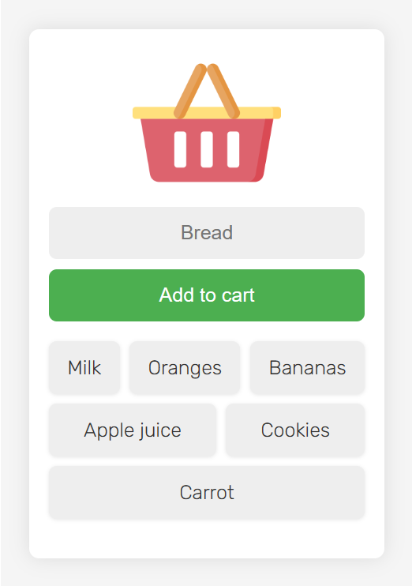

# Shopping Product List App



## Overview

This is a simple web application built using JavaScript, HTML, CSS, and Firebase to manage your shopping product list. With this app, you can easily add, remove, and update products on your shopping list, all in real-time thanks to Firebase's powerful database capabilities.

## Features

- **Real-time Updates**: Changes made to the shopping list are instantly reflected across all connected devices.

- **Add and Remove Products**: Easily add new products to your list or remove existing ones with a simple click.

## Getting Started

To get started with this app, follow these steps:

```bash
# Clone the repository to your local machine
git clone https://github.com/your-username/shopping-product-list.git

# Navigate to the project directory
cd shopping-product-list
```

## Firebase Setup

This app uses Firebase for real-time database functionality and user authentication. Follow these steps to set up Firebase for your project:

1. Create a Firebase project on the Firebase Console.
2. Enable Firestore database and Firebase Authentication for your project.
3. Replace the dataBaseURL value to your database link:

```javascript
// Your web app's Firebase configuration
const appSettings = {
  databaseURL: "YOUR DATABASE URL",
};
```

## Try It Out

This app is hosted at [URL](https://ninezern-shop.netlify.app/), where you can try it out!
